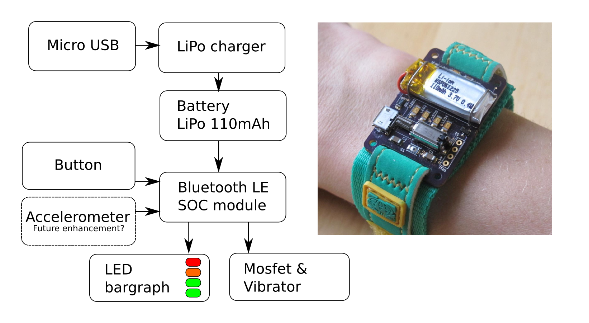

% Energy Wristband
% Matt Venn
%

# Energy Wristband

Learning about home electrical energy usage with wearable electronics.

## Introducing... the Energy Wristband

A wristband that tells you energy changes in your home. It connects via a
Raspberry Pi computer to a base station like a ['current cost' or
similar](https://www.google.co.uk/search?q=energy+monitor&biw=1309&bih=739&source=lnms&tbm=isch&sa=X&ei=jlRiVP20K7eTsQT1sYCoBA&ved=0CAcQ_AUoAg).
When a change in energy usage occurs, the wristband vibrates and a small LED
bargraph shows your current usage from 1 to 4.

Realtime energy use can be queried by pressing the button.

## Temporary ownership = maximum usage

Because home energy use is repetitive, wearing the wristband for a few weeks would be all that's needed to understand how the various household appliances use energy.

As only a short time is needed before the wristband does its work, a set is lent
to a primary school. Every 2 weeks the wristbands are passed on to the next
children. If an extra set of base stations are lent previously, then the project
could record changes in habits due to the wristband.

Getting children involved is finally a good use for [pester
power](http://en.wikipedia.org/wiki/Pester_power)!

## Get involved

I'm looking for:

* A group of people interested in supporting and helping to test the idea.
* Sponsorship in terms of kit (like radios, batteries, energy measurement base stations),
* Money/Hours for electronics/software development time,
* Money/Hours for 3D design/casting,
* Help with promotion/marketing/funding,
* Help organising workshops with schools.

## Links

* [some photos](https://plus.google.com/photos/109869064118515349190/albums/6093503170218170657) 
* [project log](docs/project_log.md)
* [Schematic and board design](https://github.com/mattvenn/eagle-circuit-designs/tree/master/energy-wristband)
* [Firmware for wristband](./firmware/), including programming the wristband
* [Setting up and installation](docs/install.md)
* [Python daemon](./daemon/) for energy monitoring and wristband communication

## Context

Home electricy usage needs to be reduced, and often there is room for easy
savings. I tried to inspire people with the numbers behind energy use with
[cursive data](http://cursivedata.co.uk) - a project that brings the numbers to
life using wall-hanging drawing robots.

Over the course of the cursive data project I discovered:

* Energy usage information in the home is repetitive (boring).
* A wall hanging drawing robot needs a lot of love and attention to work well.

A nice looking picture that's drawn in an interesting way could well inspire
someone to change their energy habits. But the method was too complex and
expensive for the results. The only real applications found for the project were
in public places.

## Licenses

* Hardware is licensed under the [CERN open hardware license 1.2](http://www.ohwr.org/attachments/2388/cern_ohl_v_1_2.txt)

* Software is licensed under a Creative Commons Attribution 4.0 International License.
