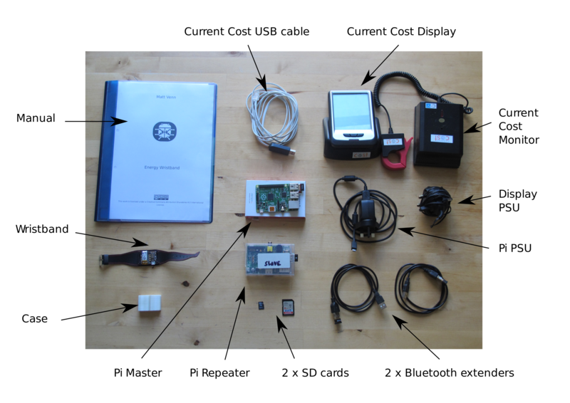

# In the box

* Raspberry Pi b+
* Raspberry Pi b
* 2 x usb wifi dongle
* 2 x usb Bluetooth dongle
* 2 x usb extender cable
* 2 x sd card (master & repeater)
* energy wristband & case
* Pi power supply
* Current Cost monitor, sender and usb cable, power supply
* manual

# Important notes

* this is a beta, so things probably won't work perfectly. With your help we'll
 get the docs and code working better!
* the wristband is not waterproof and probably a bit fragile. Please take care
 of it - there are only 2 in existance.

# Set up

## Energy wristband

charge the energy wristband with a micro usb cable

## Master Pi

This is the important one that connects to the current cost. Plug in:

* master micro sd card
* usb wifi
* usb bluetooth on a usb extender cable
* current cost usb cable

The extender cable is used to separate the wifi and bluetooth dongles as they
can cause interferance with each other and reduce the working range of the
system.

Set up the current cost sender, see the section [Fitting the transmitter to your
meter'](http://www.currentcost.com/product-envi-installation.html)

Check you're getting results on the LCD monitor. Connect the usb cable to the
back of the current cost monitor.

Plug in power to the Pi.

## Repeater Pi

If you're having issues with Bluetooth range, we can use the 2nd Pi as a
repeater.

Because Bluetooth low energy is low range, we can use the second Pi with the
repeater sd card to increase range. Plug in:

* repeater sd card
* usb wifi dongle
* usb bluetooth dongle on usb extender cable
* plug in power

# In use

The wristband has only one small button, pressing it will show you the last
energy data on the leds. If the reading is stale (more than 10 minutes) then
the leds will flash on and off.

When a large change in energy happens, the wristband will vibrate and the leds
will show you the change in energy. As you get used to wearing the wristband,
you'll notice the vibration corresponds to an increase or decrease in energy
usage.

## Tweaking

Todo...
